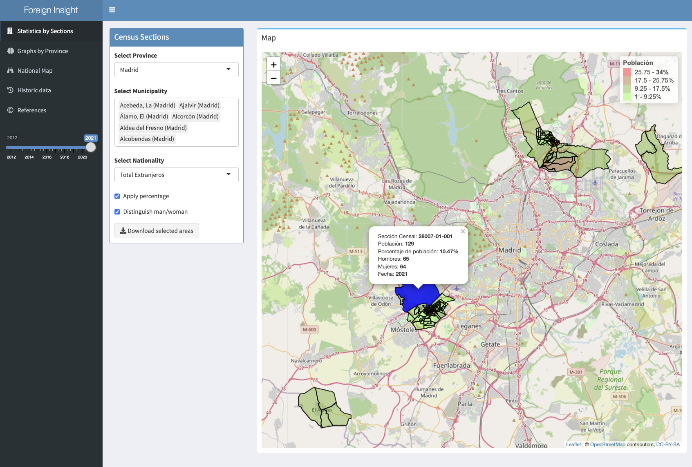
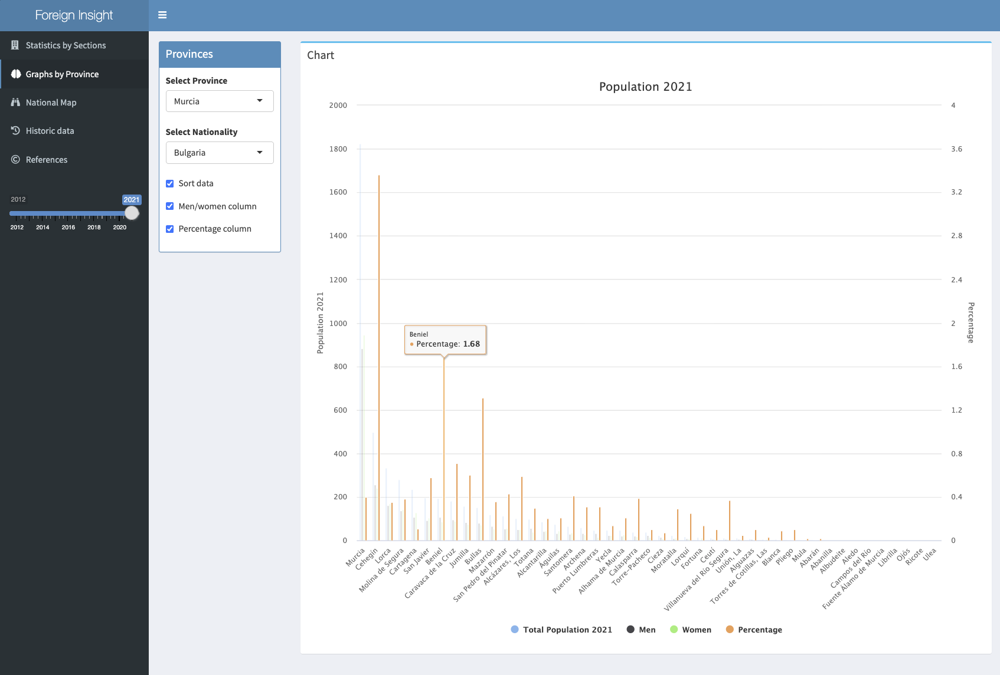
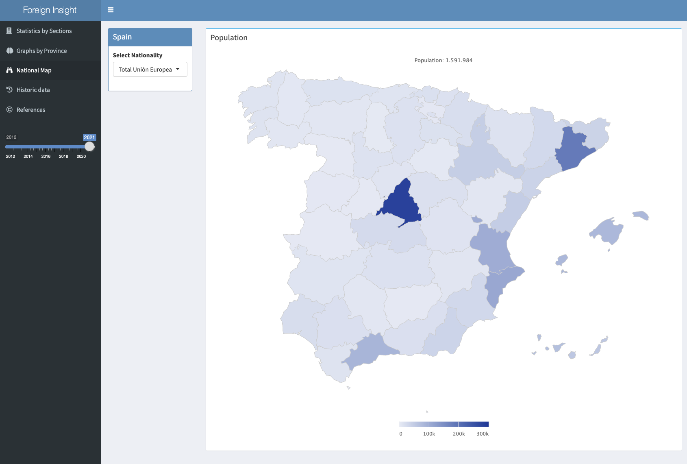
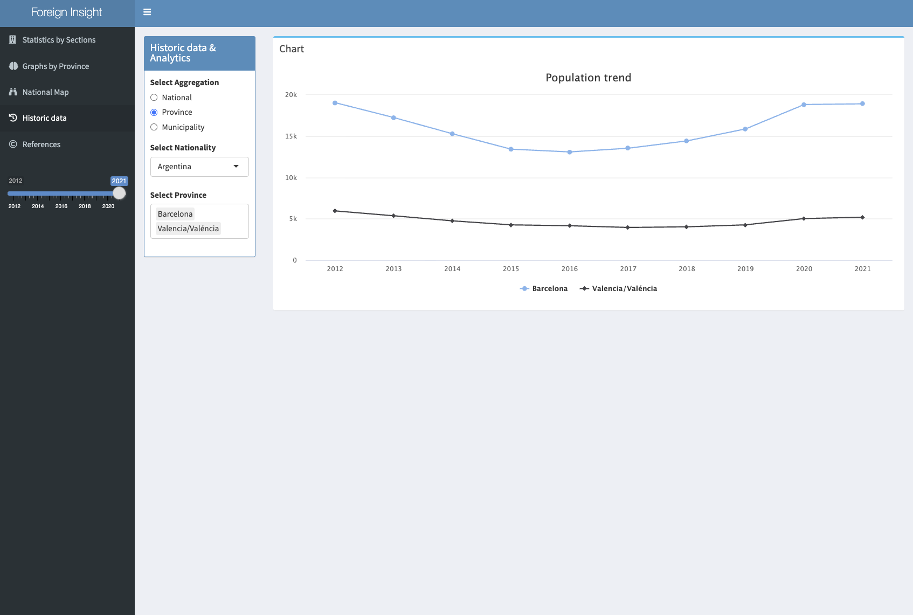

<p align="center">
  
</p>

<h1 align="center">secciones-nacionalidades</h1>

<p align="center">
  <a href="https://github.com/GeiserX/secciones-nacionalidades/actions/workflows/ci.yml"></a>
  <a href="https://github.com/GeiserX/secciones-nacionalidades/blob/main/LICENSE"></a>
  <a href="https://hub.docker.com/r/drumsergio/secciones-nacionalidades"></a>
  <a href="https://github.com/GeiserX/secciones-nacionalidades/stargazers"></a>
  <a href="https://github.com/GeiserX/awesome-spain#readme"></a>
</p>

<p align="center">
  <strong>secciones-nacionalidades (Foreign Insight): nacionalidades en España por sección censal, con datos del INE</strong>
</p>

---

Aplicación web interactiva construida con R y Shiny que permite explorar datos demográficos de nacionalidades por **sección censal** en España, utilizando datos públicos del [Instituto Nacional de Estadística (INE)](https://www.ine.es/). Se ejecuta en Docker.

## Funcionalidades

- **Mapa interactivo por secciones censales**: selecciona provincia, municipio y nacionalidad para visualizar la distribución en el mapa con código de colores
- **Descarga a KML**: selecciona las áreas de interés en el mapa y descárgalas como archivo KML, listo para importar en Google Earth o Google Maps
- **Gráficos por provincia**: visualización de barras con datos de población por municipio, con opciones de porcentaje y distinción hombre/mujer
- **Mapa nacional**: vista general de España con datos agregados por provincia
- **Datos históricos**: evolución temporal a nivel nacional, provincial o municipal

## Capturas de pantalla

| Mapa por secciones censales | Gráficos por provincia |
|:---:|:---:|
|  |  |

| Mapa nacional | Datos históricos |
|:---:|:---:|
|  |  |

> **Datos disponibles: 2012–2021.** El INE dejó de publicar los microdatos de nacionalidad por sección censal a partir del año 2022. Por tanto, esta aplicación contiene datos únicamente del periodo 2012–2021 y no recibirá actualizaciones de nuevos años salvo que el INE reanude la publicación.

## Inicio rápido

Necesitas Docker.

```bash
docker run --platform linux/amd64 -p 3838:8080 drumsergio/secciones-nacionalidades:2.1
```

Abre http://localhost:3838 en el navegador. La imagen incluye los datos de 2012 a 2021; no hace falta descargar nada.

## Documentación

- [Desarrollo](docs/development.md): cómo se actualizaban los datos cada año (archivado: el INE no publica datos posteriores a 2021).

## Licencia

[GPL-3.0-or-later](LICENSE)
